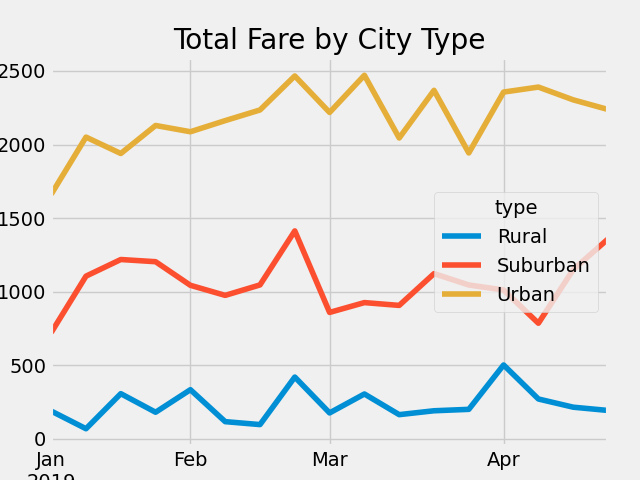
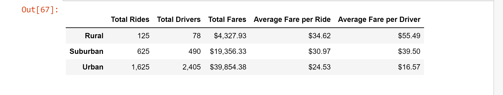

# PyBer_Analysis

## Overview of the PyBer Analysis

The purpose of this challange is to analyze PyBer's ride-sharing data and create a summary DataFrame. The data that was gathered included city names,the type of city, total number of drivers, total number of rides, and the cost of each ride. We will compare various data between three types of cities: urban, suburban, and rural. Ultimately, we will compare the total fares The tools we will be using consist of Python, Pandas, and MatPlotLib. 

## Results

By looking at the multiple-line graph below, it can be infered that PyBer's ride-sharing service generates the most revenue in urban type cities. The total fare in Urban cities ranges between $1600 to $2500 while the total fare in suburban and rural cities ranges between $700 to $1400 and $300 to $500 respectively. This data displays total fares from January 2019 to April 2019. 

We can also look at the summary dataframe to infer further conclusions. The average cost of a ride in rural cities is $34.62 while the average cost of a ride in urban cities is $24.53. The average fare per driver in rural cities is $55.49 while in urban cities it is $16.57. However, urban cities have a much larger sum of drivers, with a total of 2,405 drivers. Rural cities only had 78 drivers. This would then result in urban cities having a higher number of total rides, resulting in a total of 1,625 rides.  In all instances, data for suburban cities fell in the middle between urban and rural cities. 

## Summary
In summary, PyBer generates the msot revenue when servicing urban type cities. There is a larger numnber of rides and drivers in urban cities. This resulted in PyBer recieving a total of $39,845.38 in fares in urban cities. Interestingly, the average fare per ride and the average fare per driver is lower in urban cities than in suburban and rural cities. We may be able to infer that since there are less drivers and total rides in rural and suburban settings, the cost of the service would be higher. It is recommended that PyBer focus their services in Urban settings, as this would generate the most revenue. There is a significantly large disparity between urban and rural cities. PyBer is seen to thrive in urban cities. 
